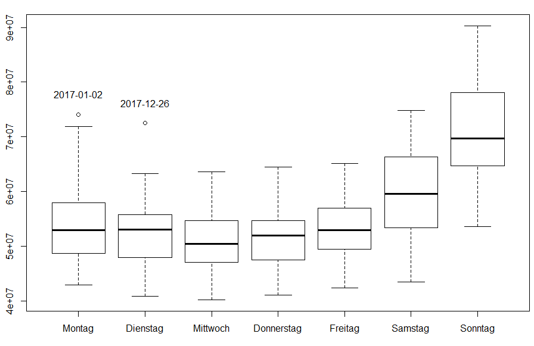
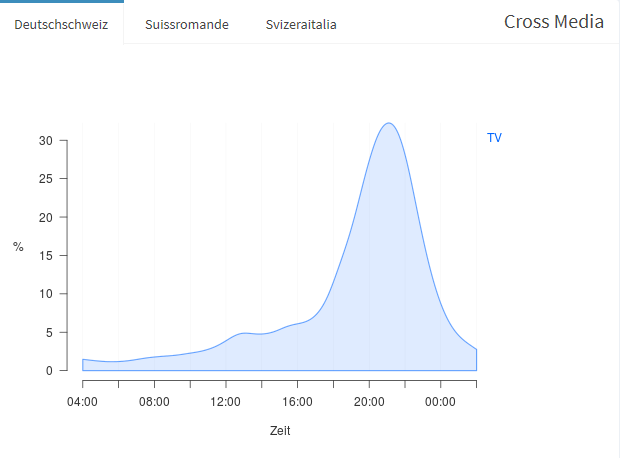

# Introduction 

TV audiance in Switzerland is measured by [Mediapulse AG](https:://www.mediapulse.ch/en).
A representative [panel](https:://www.mediapulse.ch/en/tv/research-method/the-panel.html)
of roughly 2000 households is constantly under [measurement](https:://www.mediapulse.ch/en/tv/research-method/the-measuring-technique.html).
These homes were carfully selected by a complex sampling design and all 
householdmembers have agreed to be part of the study. The TV viewing of each
householdmember is individually recorded and detailed demografics are known for 
each person. This allows the market to target TV audiances by relevant 
characteristics like age gender and many more.

One issue with the panel approach is poor granularity. That means sometimes 
the system can not provide any audiance figures for a specific channel or airtime.
It is likely that in the Swiss population of about 3.5 Mio. households at least
a few people are watching even exotic programs at exotic times of the day. 
However, out of a panel of 2000 households chances are high that no one was 
watching that content. This is not a bias of the measurement but poor resolution.

A solution to this problem could be the inclusion of third party data. 
Set-Top-Boxes (STB) of TV-provider (Swisscom, UPC, etc.) are automatically 
recording the TV consumption in millions of Swiss homes and the data is returned
to the providers servers (return path data, RPD). There are still many issues 
with these data that are currently adressed. 

One major issue of RPD is that the viewing data is on household level, not on 
indvidual level. Household-level data is of little use to the market. Because it
gives no insight in target groups based on age and gender and alike. 

It is unlikely that RPD provider will ever measure the individual viewing or 
survey individual demografics within the subscribers homes. Apart from region 
code, the only information about the home is the viwing data itself. So the 
question arises if it is possible to predict the household composition based 
on viewing behavior.

The aim of this study is to explore the possiblity to predict the household 
composition within a household using TV viewing data. It seems to be a 
two-step-problem, first to find the number of householdmembers and then to 
assign age and gender to the individuals.

We will use the _Mediapulse TV-Panel_ and its viewing data to study the subject.
For all households in the panel its composition including household size and 
age and sex of each person is known. For each panel home the viewing 
data will be aggregated to household level. Different supervised machine 
learning algorithms will be fed with features extracted from that houesehold 
viewing data.

# Target: Household Composition

## Data Import

A R-Package `tv` is used to import the raw data of the _Mediapulse-TV-Panel_.
The setup functions allows to specify the data to be read from disk into R. 
The import functions by default returns three data.tables: 

1. `dem`: all individuals with their demografics
2. `view`: the TV viewing
3. `prog`: the program timetable with genre information

## Date Range

TV viewing behavior is known to differ by season as well as by weekdays. During 
cold months TV viwing is more popular than during Sommer months. Similarly, on 
weekends people watch more TV than during the rest of the week.
Not only differs the total viewing duration. Also the individual preferences for
channels and programs might differ between weekend and workdays.

To extract freatures of TV viewing, we will consider a range of 8 weeks during 
2017. This should be long enough to reflect the individual viewing patterns. 
We focus on cold months and a period free of holidays or special TV events 
(FIFA Wolrdcup, etc.). We make sure to get an equal number of each weekday.

```{r}
dayx <- as.Date('2017-11-12')
days <- seq(dayx - 28, dayx + 27, by = "day")
table(weekdays(days))
```

## Household Composition

A Household is not necessarily under measurement on every day of our 8 weeks. 
Sometimes a household leaves the panel, then a new household will join the panel. 
Also for technical reasons a household may drop the panel just for a couple of 
days.

To create a dataset of households not all households within the 8 weeks were 
included. Rather, the sample of a single specific day is choosen. This day is a 
sunday and exactly in the middle of the 8 weeks. The difference is small anyway,
e.g. routhly a 2000 versus 2100 households. 

```{r message = FALSE, results = 'hide'}
library('tv')
id <- setup(days, obs = "ind", dem.var = c("sg","hhsize","age","sex"), 
            dem.day = dayx, dem.uni = FALSE, view = FALSE, prg = FALSE)
import(id)
```
```{r include = FALSE }
dem[, `:=` (hh = pin %/% 1e2L, ind = pin %% 1e2L)]
ordercol(dem, c("hh","ind"), "day")
```
```{r }
(dem <- dem[(!guest)]) # excluding guests
```

On our sample day `r dayx` the TV-Panel was formed by `r uniqueN(dem$hh)` 
households and `r nrow(dem)` individuals living in these households. This gives 
a average householdsize of `r round(nrow(dem) / uniqueN(dem$hh), 2)`.

A note on the variale _hhsize_. Household size is not constant over time, the 
number of people living in a household can change by natural reasons like birth,
death, moving in or out. Also the variable _hhsize_ is not necessarily equal to 
the sum of individuals for the following reasons:

* babys 0-2 years old are not part of the panel
* guests are part of the data but not counted for household size
* houshold size is counted 1, 2, ..., 5+, 5+ meaning housholds with 5 or more 
members

A simple transformation of the `dem` data.table presents for each household on 
a row its composition. There are `r uniqueN(dem$hh)` households. We call the 
household ID `pin` and `sg` is the linguistic region (german, french, italian).
Age and Sex of up to 8 householdmembers. There is no missing data.

```{r }
hh <- dcast(dem, day + hh + sg + hhsize ~ ind, value.var = c("age","sex"), fill = 0L)
setnames(hh, 'hh', 'pin')
rm(id, dem)
hh
```

# Features: Viewing Behavior

## Data Import

We use our knowledge and intuiton about TV viewing to generate features we 
believe would carry information about the household composition. 

1. Dimension time
    + Weekend vs. Workingdays
    + daytime
2. Dimension content (genre)
    + type of channel 
    + type of program

To split the data by weekend vs workingdays we do not specify anything but later
simply use the date variable.

To split the data by daytime the `tv` package allows us to specify so called 
timebands.

We are interested in the viewing on household level. The `tv` package allows
to specify this with the `setup(obs = "hh")`. Simply summing up all individuals
viewing within a household doe not mean household level. If people watch 
together than this viewing counts only once.

```{r, results = 'hide'}
id <- setup(
  day = days,
  guest = FALSE,
  obs = "hh",
  dem.var = "sg",
  tmb = list(
    '02to06' = c(start = '02:00:00', end = '05:59:59'),
    '06to08' = c(start = '06:00:00', end = '07:59:59'),
    '08to11' = c(start = '08:00:00', end = '10:59:59'),
    '11to13' = c(start = '11:00:00', end = '12:59:59'),
    '13to17' = c(start = '13:00:00', end = '16:59:59'),
    '17to20' = c(start = '17:00:00', end = '19:59:59'),
    '20to22' = c(start = '20:00:00', end = '21:59:59'),
    '22to24' = c(start = '22:00:00', end = '23:59:59'),
    '24to02' = c(start = '24:00:00', end = '25:59:59')
  )
  )
import(id)
```

## sum viewing by weekpart and daytime

The 'tv' package provides a function 'dem.add' to add weekday and more calendar 
variables given the date in a column.

```{r}
dem.add(dem, 'calendar')
nday <- dem[, .(N = uniqueN(day)), k=.(pin, wend)]
```

```{r, include = FALSE}
calc.uni(dem[, weight := 1L]) # ungewichtet
```

```{r, results = 'hide'}
res <- calc(
  dt = view[dem, on=c('day',"pin")], 
  by = c("day","tmb","pin"), 
  period = "tmb.dur"
)

dem.add(res, 'calendar')

res <- res[, sum(dur), k=c("wend","tmb","pin")]
res[, nday := nday[res, on=c('wend','pin'), N]]
# na.omit(res, invert = TRUE)
res[, mean.dur := V1 / nday]
res[, wend := id$lab$wend[res, on='wend', label]]

X.tmb <- dcast(res, pin ~ wend + tmb, value.var = "mean.dur")
X.tmb <- X.tmb[hh[,.(pin)], on="pin"]
na.to.0(X.tmb) # na.omit(X.tmb, invert = TRUE)
setnames(X.tmb, -1, paste0("day_",tolower(names(X.tmb)[-1])))
```

## sum viewing by channel groups

The `tv` package provides a mapping table for channels including channel names 
but also information on the type (genre) country of origin and language of each
channel

```{r, results = 'hide'}
id$lab$sta
```

```{r, results = 'hide'}
cols <- c("chn.type","chn.country","chn.lang")
view[, (cols) := id$lab$sta[view, on=c(id="base"), mget(cols)]]
ordercol(view, cols, "chn.name")
# view[, any(is.na(chn.type))]
```

### channel types

```{r, results = 'hide'}
res.type <- calc(
  dt = view[dem, on=c('day',"pin")], 
  by = c("day","pin","chn.type"), 
  period = "day"
)
res.type <- res.type[, sum(dur), k=c("chn.type","pin")]
res.type[, nday := nday[, .(N=sum(N)), k=pin][res.type, on='pin', N]]
# na.omit(res.type, invert = TRUE)
res.type[, mean.dur := V1 / nday]

X.chn.type <- dcast(res.type, pin ~ chn.type, value.var = "mean.dur")
X.chn.type <- X.chn.type[hh[,.(pin)], on="pin"]
na.to.0(X.chn.type) # na.omit(X.chn.type, invert = TRUE)
```

### channel country of origin

```{r, results = 'hide'}
res.country <- calc(
  dt = view[dem, on=c("day","pin")], 
  by = c("day","pin","chn.country"), 
  period = "day"
)
res.country <- res.country[, sum(dur), k=c("chn.country","pin")]
res.country[, nday := nday[, .(N=sum(N)), k=pin][res.country, on='pin', N]]
# na.omit(res.country, invert = TRUE)
res.country[, mean.dur := V1 / nday]

X.chn.country <- dcast(res.country, pin ~ chn.country, value.var = "mean.dur")
X.chn.country <- X.chn.country[hh[,.(pin)], on="pin"]
na.to.0(X.chn.country) # na.omit(X.chn.country, invert = TRUE)
```

### channel language

```{r, results = 'hide'}
res.lang <- calc(
  dt = view[dem, on=c("day","pin")], 
  by = c("day","pin","chn.lang"), 
  period = "day"
)
res.lang <- res.lang[, sum(dur), k=c("chn.lang","pin")]
res.lang[, nday := nday[, .(N=sum(N)), k=pin][res.lang, on='pin', N]]
# na.omit(res.lang, invert = TRUE)
res.lang[, mean.dur := V1 / nday]

X.chn.lang <- dcast(res.lang, pin ~ chn.lang, value.var = "mean.dur")
X.chn.lang <- X.chn.lang[hh[,.(pin)], on="pin"]
na.to.0(X.chn.lang) # na.omit(X.chn.lang, invert = TRUE)
```

### put together channel features 

```{r, results = 'hide'}
# these are nested left joins:
X.chn <- X.chn.type[,-"0"][X.chn.country[,-"0"][X.chn.lang[,-"0"], on="pin"], on="pin"]
setnames(X.chn, -1, paste0("chn_",tolower(names(X.chn)[-1])))
```

## sum viewing by program genre

The 'tv' package provides a function `overlap.join` for joined overlap of time 
segements. This splits all viewing statements by the corresponding program 
schedule by day and by channel.

```{r, results = 'hide'}

view <- overlap.join(view, prog, type='prg')

res.genre <- calc(
  dt = view[dem, on=c("day","pin")], 
  by = c("day","pin","genre"), 
  period = "day"
)
res.genre <- res.genre[, sum(dur), k=c("genre","pin")]
res.genre[, nday := nday[, .(N=sum(N)), k=pin][res.genre, on='pin', N]]
# na.omit(res.genre, invert = TRUE)
res.genre[, mean.dur := V1 / nday]

X.genre <- dcast(res.genre, pin ~ genre, value.var = "mean.dur")
X.genre <- X.genre[hh[,.(pin)], on="pin"]
na.to.0(X.genre) # na.omit(X.genre, invert = TRUE)
setnames(X.genre, -1, paste0("prg_",tolower(names(X.genre)[-1])))
```

## combine all Features in one data.table

```{r, results = 'hide'}
predictors <- X.tmb[X.chn[X.genre, on="pin"], on="pin"] # nested left joins
setnames(predictors, 'pin', 'hh')
setorder(predictors, 'hh')
```

## View Features

```{r }
predictors[, 1:4]
matrix(names(predictors), ncol = 3)
```

## Export Data

```{r, results = 'hide'}
hh.composition <- hh[, day := NULL]
setnames(hh.composition, 'pin', 'hh')
setorder(hh.composition, 'hh')

# save(hh.composition, predictors, file = '~/diplom/data/data_predictors.RData')

```

\pagebreak
<div style="page-break-after: always;"></div>

# Appendix

```{r, echo = FALSE, out.width="90%", fig.align="center", fig.cap="\\label{fig:figs}Amount of TV viewing by weekdays during 2017. More viewing on weekends, festival days behave like sundays"}
library(knitr)

```

```{r echo = FALSE, out.width="90%", fig.align="center", fig.cap="\\label{fig:figs}Relative amount of TV viewing during a day. Averaged across one Year."}

```
