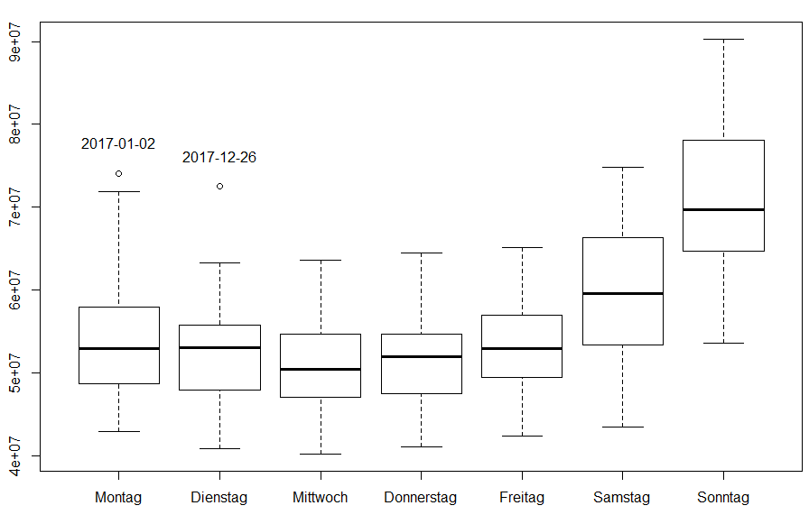

# Summary

In this study TV viewing data from individuals was aggregated to household level to find out if the household size can be predicted based on the households TV viewing. This simulates the obstacle that has to be mastered when RPD data has to be integrated with traditional panel data.
For each home the average daily viewing duration in seconds across an 8 week period was extracted for 53 different features such as daytime, weekday, type of channel and program genre.
The sample of 2006 homes were split by a ratio of 6:4 and used for training and cross validating, respectively. Three different machine learning algorithms were applied, multinomial linear regression, support vector machine and random forest. All three classifier performed similarly poor on test data with an overall accuracy of 42% to 44%, given a baseline accuracy of 27%.
Separating small (household size 1 and 2) versus bigger homes (household size 3, 4 and 5) was the main pattern found and features like viewing on kids channel and kids programs among others was found to be particularly important. We conclude that a households TV consumption is not informative enough to derive the number of individuals living in that home.

# Introduction 

TV audience in Switzerland is measured by [Mediapulse AG](https:://www.mediapulse.ch/en).
A representative [panel](https:://www.mediapulse.ch/en/tv/research-method/the-panel.html)
of roughly 2000 households is constantly under [measurement](https:://www.mediapulse.ch/en/tv/research-method/the-measuring-technique.html).
These homes were carefully selected by a complex sampling design and all 
household members have agreed to be part of the study. The TV viewing of each
household member is individually recorded and detailed demographics are known for 
each person. This allows the market to target TV audiences by relevant 
characteristics like age gender and many more.

One issue with the panel approach is its poor granularity. That means sometimes 
the system can not provide any audience figures for a specific channel or airtime.
It is likely that in the Swiss population of about 3.5 million households at least
a few people are watching even exotic programs at exotic times of the day. 
However, out of a panel of 2000 households chances are high that no one was 
watching that content. This is not a bias of the measurement but poor resolution.

A solution to this problem could be the inclusion of third party data. 
Set-Top-Boxes (STB) of TV-provider (Swisscom, UPC, etc.) are automatically 
recording the TV consumption in millions of Swiss homes and the data is returned
to the providers servers (return path data, RPD). There are still many issues 
with these data that are currently addressed. 

One major issue of RPD is that the viewing data is on household level, not on 
individual level. Household-level data is of little use to the market. Because it
gives no insight in target groups based on age and gender and alike. 

It is unlikely that RPD provider will ever measure the individual viewing or 
survey individual demographics within the subscribers homes. Apart from region 
code, the only information about the home is the viewing data itself. So the 
question arises if it is possible to predict the household composition based 
on viewing behavior.

The aim of this study is to explore the possibility to predict the household 
composition within a household using TV viewing data. It seems to be a 
two-step-problem, first to find the number of household members and then to 
assign age and gender to the individuals.

We will use the _Mediapulse TV-Panel_ and its viewing data to study the subject.
For all households in the panel its composition including household size and 
age and sex of each person is known. For each panel home the viewing 
data will be aggregated to household level. Different supervised machine 
learning algorithms will be fed with features extracted from that household 
viewing data.

# TV Viewing Data

Mediapulse TV viewing raw-data comes in the form of daily text files. There are 
three types of files:

1. `dem`: all individuals with their demographics and daily weights
2. `view`: the TV viewing (live and time-shifted viewing)
3. `prog`: the program timetable with genre information

A commercial software allows to analyse this data via an easy to use software 
tool. The output of this Software is the official Swiss TV audience measure
published by Mediapulse AG and accepted by the market. I have written an 
R-package that allows to read and analyse the very same input raw-data and 
output the very same results (e.g. daily estimates, the so called "Facts" like 
_Reach_, _Rating_ or _Share_, etc.). The fact that the results between Software 
and R-package match precisely, guarantees that the data processing in R is 
correct, plus it allows to check if all calculations and aggregations are 
correctly implemented as intended.

```{r, tab1, echo = FALSE}
library(knitr)
view <- data.frame(
  day   = rep('2018-01-01', 3),
  hh    = rep(2381, 3),
  ind   = c(1,1,2),
  chn   = c('SRF 1','ARTE','ARTE'),
  start = c('18:04:21', '18:45:20','18:45:20'),
  end   = c('18:13:02', '20:05:45','19:45:03')
)
kable(view, caption="\\label{tab:tab1}TV viewing raw-data (simplified). Reading example: On day `2018-01-01`, in household `2381` individual `1` is watching channel `SRF 1` from `18:04:21` to `18:13:02`. Later that day this person switches to channel `ARTE` and is joined by another household member individual `2`.")
```

Demographic information is simply joined on keys `day`, `hh` and `ind`. Program 
schedule is joined via an overlap join on keys `day`, `channel` and `start`/`end`. 
If a viewing statement overlaps with multiple programs, the statement gets 
duplicated and the `start`/`end` intervals needs to be cropped to the viewing 
interval boundaries.

# Target and Feature

## Target: Household Composition

The aim of this study is to predict the household composition in form of the 
household size, e.g. the number of people living in the household. Our sample 
for this study comprises 2006 homes in which a total of 4388 individuals 
are living in. This gives an average household size of 2.19.

The variable _hhsize_ is given in the demographics file of the TV raw-data.
_hhsize_ is not necessarily equal to the sum of individuals for the following 
reasons:

* children 0-2 years old are not recorded (this is a market convention)
* guest are part of the TV-panel but not counted for household size
* household size is coded 1, 2, 3, 4, 5+, with 5+ meaning households with 5 or 
more members

Another detail is that household size is not necessarily constant over time. The 
number of people living in a household may change by natural reasons like birth,
death, moving in or out. We use the hhsize of a single sample day and assume the 
household size is constant for the period of viewing data we are using.

```{r, echo = FALSE, warning = FALSE, messages = FALSE}
load('~/git/diploma/data/data_predictors.RData')
hh.composition <- as.data.frame(hh.composition)
predictors <- as.data.frame(predictors)
kable(tail(hh.composition[, c(1,3:8,12:16)], 3), row.names = NA, 
      caption="Household composition is the sociodemografic profile of a household, for example, household size, and age and gender of the household members. The last 3 of our sample of 2006 households are shown. For this study the target to predict is _hhsize_.")
```

## Generating Features of Viewing Behavior

### Selecting 8 Weeks of Viewing Data

For this study, a sample day was fixed, and the viewing data of all panel member
present at that day is collected 4 weeks prior and 4 weeks after that date. 
The sample day is the Sunday `2017-11-12` and comprises 2006 households and 4388 individuals respectively. 

The period of eight weeks should be long enough to reflect individual viewing 
behavior. Autumn was chosen because during colder months people are watching 
more TV than in Summer. This period is free of holidays or unusual TV events
(FIFA World cup, etc.). Within the 7 * 8 = 56 days, the weekdays Mondays to 
Sundays are balanced. This is relevant as TV viewing differs significantly 
between weekends and workdays (Figure \ref{fig:fig1}).

### TV Viewing on Household Level

The TV raw-data described earlier shows that _Mediapulse TV data_ is recorded for
each individual. With RPD data however this is not the case. RPD data only provide 
viewing data on household level. Which person, or how many person are sitting in
front of the TV set is unknown. Also, there is no demographic information 
accompanying RPD data. Here we study if it is possible to predict at least the 
number of household members if only TV viewing on household level is known, like 
with RPD data. To this end the _Mediapulse TV data_ have to be aggregated form 
individual level to household level. This means, if more than one person is 
watching the same content, on household level, this is reflected by a single 
viewing statement. This household aggregation algorithm is somewhat more complex, 
but not relevant here.

### Feature Generation

Features are a set of variables that are used as input data for Machine Learning 
Classifiers or as predictors for statistical models. In both cases we aim to 
predict the target variable _hhsize_. To create features of viewing behavior 
the TV data on household level is summed up for each household and day, by 
different characteristics. Then, for each household the average across the 56 days 
was calculated. TV viewing is expressed as the duration of viewing in seconds. 

The characteristics underlying the feature generation is guided by industry 
knowledge and intuition about TV viewing behavior we believe would carry 
information about the household composition, i.e:

1. Dimension time
    + weekend vs. working days
    + time of the day
    
2. Dimension content
    + type of channel 
    + type of program genre

Figure \ref{fig:fig1}, and Figure \ref{fig:fig2} in the Appendix are illustrating
the effect of the dimension _time_ on total TV viewing. 

There are over 300 TV channels received in Switzerland. In comparison to other 
countries this so called _inspill_ is very large. Because of the small size of 
Switzerland and its different linguistic regions there are many foreign channels 
being watched from the neighboring countries. For simplification the channels 
have been mapped to channel groups. There are 3 type of groups: channel type, 
language, and country of origin.

The program genre is a pre-specified variable in the program schedule files. 
Each program is categorized to one of the 14 different genres. The TV viewing 
data is overlapped and split up by the program schedule. The viewing duration is 
than summed up by each program genre within each household.

```{r, tab3, echo = FALSE}
n <- names(predictors)
t1 <- grep('weekend', n, value = TRUE)
t2 <- grep('workday', n, value = TRUE)
ch <- grep('chn', n, value = TRUE)
pg <- grep('prg', n, value = TRUE)

df <- as.data.frame(matrix(NA, nrow = length(ch), ncol = 3))
names(df) <- c('weekpart by time of day', 'channels', 'programs')
df[1:length(c(t1,t2)), 1] <- c(t1,t2)
#df[1:length(t2), 2] <- t2
df[1:length(ch), 2] <- ch
df[1:length(pg), 3] <- pg

df[is.na(df)] <- ''
kable(df, caption="The sets of features of TV viewing behavior to predict household composition.")
```

```{r, tab4, echo = FALSE}

if(all(hh.composition$hh == predictors$hh))
  predictors <- cbind(
    hh = predictors[,1], hhsize = hh.composition$hhsize, predictors[,-1]
    )

kable(predictors[1:6, 1:5], caption="Final input data set. Shown are the first 6 rows and the first 5 columns. Each of the 2006 households is an observation on rows and identified by the household ID _hh_. The household size, the target to predict, is given in column _hhsize_. All 53 above mentioned features are given in the following columns. The values are the average daily viewing duration in seconds by feature on  household level.")
```

# Data Exploration

## Classification versus Regression

Theoretically household size can be interpret both as five separate categories 
or as a scale (ordinal or proportional) ranging from 1 to 5. For this study we interpret household size as categorical variable and therefor apply classification not regression. One reason is that behind a specific household size very different
types of household compositions may exist. For example a two person household could consist of an elderly couple, a two young students of the same gender, a single parent with a child, etc. Accordingly the TV viewing behavior in households of the same size
may differ significantly given the possible variety of demographics profiles. 

```{r, echo = FALSE}
predictors$hhsize <- factor(predictors$hhsize)
levels(predictors$hhsize) <- paste0("hhsize", levels(predictors$hhsize))
```

## Log Transformation

Screening through the values of the 53 feature variables reveals that often the
viewing duration is strongly right skewed and zero inflated (see Figure \ref{fig:fig3} in the Appendix). That means most households have a relatively low value of TV viewing duration but for a few households the viewing is relatively high. A log transformation makes the data more symmetric. Although in general for Machine Learning algorithms such a transformation is unnecessary, it should neither be harmful, and we continue with log transformed data. Because of many zero values we use the transformation 'log(x + 1)'.

```{r, echo = FALSE}
pred.log <- cbind(predictors[, (1:2)], lapply(predictors[, -(1:2)] + 1, log))
```

## Visualization of Features

Before applying statistical methods, we can simply visually explore if there is a predictor variable that separates well the households by household size. Figure \ref{fig:fig4} in the Appendix shows some examples. For most features there is
no such discrimination power apparent. But the amount of viewing kinds channels 
seems to separate small and bigger households.

Another option is to visualize the correlation between feature and between features and the target variable. Figure \ref{fig:fig5} in the Appendix shows a heat map of the correlation matrix of the input data. The correlation is a standardized measure for the similarity between features between. The correlation with the target variable reflects how strong a linear relation ship exists between a particular feature and household sizes 1 to 5. This is only of limited use as we're also interested in any non-linear relation with the five household sizes which we interprets as nominal classes here. 

The dendrogram attached to the heat map in Figure \ref{fig:fig5} uses the correlation structure to visualize the between-features association in a hierarchical order.

## Dimensionality Reduction

The 53 features are not a lot and far less than the 2006 observations. Still, some of these variables may not carry much information or they are redundant to other variables (e.g. highly correlated). 
For an example of dimensionality reduction Principal Component Analysis (PCA) 
was chosen. PCA was calculated using the 'prcomp' package with centering but no scaling of the log transformed data matrix. All the features represent the same 
unit of viewing duration. Figure \ref{fig:fig6} and \ref{fig:fig7} in the Appendix shows the results
of the PCA.

If PCA finds a few principal components that together explain a big portion 
of the total variance, these synthesized features could replace the original input data. 
The whole effects on the target variable could be summarized by 2 or 3 (orthogonal) 
dimensions. 

However, Figure \ref{fig:fig6} shows no such simple decomposition. There is a dominant first component explaining 30% of the variance. Most likely this component reflects the magnitude of overall TV consumption. All following components only explain a fraction. To reach a cumulative proportion of about 80% more than ten components are needed. Given the general difficulty of a real-world interpretation of PCs, working with the PCA transformed data is of little use here.

```{r, tab5, echo = FALSE}

pca <- prcomp(pred.log[,-(1:2)], center = TRUE, scale. = TRUE)

x <- t(summary(pca)$importance[, 1:6])
kable(x, caption="\\label{tab:tab5} First 6 PCs. The Variance in the feature matrix is not easily separated in orthogonal components. To reach 80% cumulative explained variance the first 16 PCs would be needed.")
```

## Probability to Correctly Classify by Chance

The probability to correctly classify by chance is 20%, if all five levels 
of household size were uniformly distributed (naive estimation). 

```{r, echo = TRUE}
x <- replicate(100, sample(1:5, nrow(hh.composition), replace = TRUE))
round(mean(apply(x, 2, function(y) mean(y == hh.composition$hhsize))), 2)
```

However, we know the probability of each household size level in our sample:

```{r, echo = TRUE}
p <- prop.table(table(hh.composition$hhsize))
c(hhsize = round(p*100, 2))
```

Therefore we can calculate the probability of correct classification by chance
more precisely:

```{r, echo = TRUE}
round(sum(p^2), 2)
```

The estimation by simulation comes close:

```{r, echo = TRUE}
x <- replicate(100, sample(1:5, nrow(hh.composition), replace = TRUE, prob = p))
round(mean(apply(x, 2, function(y) mean(y == hh.composition$hhsize))), 2)
```

## Partitioning into Train and Test Data

The 2006 households are split into two datasets, one for training and one for 
testing. The training data makes 60% of households and will be used to train the different models. The test data consists of the other 40% of households and will 
be used for cross validation, .i.e. to test how good the trained models perform when classifying new data.

```{r, echo = TRUE, message = FALSE}
library(caret)
set.seed(999)
train <- caret::createDataPartition(pred.log$hhsize, p = .6, list = FALSE)
d <- list(train = pred.log[train,-1], test = pred.log[-train,-1])
```

A stratified random sampling is used to split the households. Stratification by 
household size guarantees that the distribution of household size is 
the same between train and test data. So the cross validation is more reliable.

```{r, tab6, echo = FALSE}
x <- cbind(`train` = table(d$train$hhsize), `test` = table(d$test$hhsize))
x <- cbind(x, cbind(`train %` = x[,1]/sum(x[,1]), `test %` = x[,2]/sum(x[,2])))
kable(round(x, 2), caption="\\label{tab:tab6} The 2006 household are split randomly into train (60%) and test (40%) data, with stratification by household size.")
```

# Model Specification

## Multinomial Logistic Regression

### Full Model

The multinomial logistic regression models the log odds of the five household 
size levels as a linear combination of the predictor variables. We will use the
full model with all features when assessing the prediction performance. 

```{r, echo = TRUE, results = 'hide'}
library(nnet)
m.mnr <- multinom(hhsize ~ ., data = d$train, trace = TRUE, maxit = 500)
```

### AIC Optimized Model

In contrast to Machine Learning algorithms (ML), a statistical model describes the 
relationship between predictors and outcome variable as a mathematical formula.
That equation is fitted to the data in the best possible way. However if the 
formula does not describe the true relationship the result remains sub optimal.
There are many possible ways of specifying a model, including transformation of 
predictors (non-linear relationship) and specification of interactions between 
predictors (depending on the state of other predictors). To find the best model 
in statistical terms, all models have to be fitted and compared against each 
other. A good model in statistical terms is a model that explains as much variance of the target variable as possible with the smallest number of predictors. The AIC criterion assesses each model by the explained variance subtracted by a punishing factor for each additional model term. 

Each model is basically a hypothesis fitted and tested against the data. Running through 
all possible models to approach the best one is cumbersome and time consuming 
If the true relationship between predictors and outcome variable 
is not among our pre-defined set of models we will not find the optimum and 
prediction will be sub optimal. But the advantage over ML is that once a 
satisfying model is found, the relation between predictors and outcome 
variable follows a mathematical equation. The modelling and prediction is parametric and fully transparent.

We will use an automated stepwise model search to find a good model. For 
simplicity we only model linear relationships. We will not use this model to 
compete against ML but to separate relevant from irrelevant predictors. 

```{r, eval = FALSE, echo = TRUE, message = FALSE}
require(MASS)
m.mnr.best <- MASS::stepAIC(mnr)
```
```{r, eval = FALSE, echo = FALSE}
save(m.mnr.best, file = './data/stepAIC.RData')
```
```{r, echo = FALSE}
load('~/git/diploma/data/stepAIC.RData')
m.mnr.best <- res
rm(res)
```
```{r, echo = FALSE}
x <- data.frame(
  c(m.mnr$AIC, m.mnr.best$AIC),
  c(length(colnames(coef(m.mnr))[-1]), length(colnames(coef(m.mnr.best))[-1]))
)
dimnames(x) <- list(c('full model','best model'), c('AIC','Terms'))

knitr::kable(x)
```

A chi-square test between the full model and the reduced model is far from 
significant. This means that the full model is not better than the reduced model.
This is expected from the the AIC stepwise model search.

```{r, eval = FALSE}
anova(m.mnr.best, m.mnr, test = 'Chisq')
```

## Support Vector Machine

### linear

Each household has a vector of 53 feature values. Let's interpret the input 
data as a 53 dimensional space in which the 2006 households are located. Support
Vector Machine constructs hyperplanes that separate the households by household 
size. It is a binary classifier, with 5 more than two classes it runs through 
all each time separating one against all others. Usually there is no perfect 
separation, some households still lie on the other side of the hyperplane. The 
best separation out of many possible solutions is chosen to be the one with the
biggest distance to the closest points. Points within this margin and beyond 
the hyperplane are penalized as further apart they are located (hinge loss). 
Tuning the error distance with high costs, tends to improve the classification on
training data with the risk of overfitting and bad classification on new data, 
et vice versa.

```{r, echo = TRUE, message = FALSE}
library(e1071)
m.svm.linear <- svm(hhsize ~ ., data = d$train, kernel = "linear", cost = 1)
```

### Radial Kernel

Adding non-linearly transformed features to the input data, increases the chances
that a well separating hyperplane can be found. In theory, adding enough well 
transformed features makes any training data perfectly separable. However such a 
sophisticated fit to the training data carries a high risk of poorly performing 
on new data. We use a Gaussian kernel to add transformed features on the fly.
In contrast to the non-transformed input data, this would allow to separate 
households if they were to form clusters by household size at some dimensions in
the feature space.

```{r, echo = TRUE, message = FALSE}
m.svm.radial <- svm(hhsize ~ ., data = d$train, kernel = "radial", cost = 15, 
                    gamma = 0.01)
```

Optimal values for parameters like cost and gamma were be found by tuning procedures. 
However what ever is optimized on training data is not necessarily beneficial 
for prediction accuracy on new data.

## Random Forest

A decision tree is an iterative partitioning of the input data. For each feature
the best binary split is found so that in the subsets the occurrence of the  
of household size classes is as homogeneous as possible. The feature with the 
best split serves as the first node to split the input data. For each subset the 
procedure is repeated resulting in a tree like partitioning. For prediction, new 
data is run through the very same decision rules. The end leafs of the tree 
represent the final decisions to which class a new case belongs to. The end leaf 
might not be pure, not allowing a deterministic decision for one or the other 
household size class, so the majority class from training is taken. Such a single
tree models very specific patterns and has a high risk of overfitting. 

Random forest averages the results of many trees. For each tree only a random subset of observations is used. This bootstrapping increases bias and reduces variance in each tree, making the final average more accurate for predicting new data. The aggregation across trees is only beneficial for accuracy gain if the trees are independent among each other. At each node the splitting variable is chosen from a random subsample of all features, introducing some degree of independence among the trees. Figure \ref{fig:fig10} shows the out of box (OOB) error rate across the 500 trees that were calculated.

Because the five household size classes or not uniformly distributed we instruct 
the Random Forest algorithm to use a stratified subsample for each tree. 

```{r, echo = TRUE, message = FALSE}
library(randomForest)
m.rf <- randomForest(hhsize ~ ., data = d$train, imortance = TRUE, 
                     strata = d$train$hhsize, 
                     sampsize = rep(min(table(d$train$hhsize)), 5) * .7
                     )
```

# Results

## Performance

### Accuracy

Accuracy was calculated as the average correctly classified households. Because 
this formula ignores the different frequencies of household size classes, the 
accuracy on small households are more influential in this overall score. A score 
of 1 (or 100%) means perfect match, 0 or (0%) not a single match. A random 
matching process would generate an accuracy of .27 (or 27%), as outlined above.

The accuracy on training set is the model fit. More important is the cross 
validation with test data. If a trained model performs well on new data this 
means the rules for classification are of general importance and not restricted 
to train data. The cross validation on the a test data set also allows to directly 
compare different models.

```{r, echo = FALSE}
models <- list(
  multinomial  = m.mnr, 
  randomforest = m.rf, 
  svm.linear   = m.svm.linear,
  svm.radial   = m.svm.radial
  )

pred <- list(
  train = as.data.frame(lapply(models, predict)),
  test  = as.data.frame(lapply(models, predict, newdata = d$test))
)

calc.acc <- function(predicted, observed) mean(predicted == observed)

tabl.acc <- rbind(
  train = sapply(pred$train, calc.acc, observed = d$train$hhsize),
  test  = sapply(pred$test,  calc.acc, observed = d$test$hhsize)
)
```

```{r, tab7, echo = FALSE}
kable(round(t(tabl.acc), 2), caption="\\label{tab:tab7} The Accuracy in train and test dataset for the different classifiers.")
```

In all cases accuracy on train data is better than on test data, as expected. 
On test data all four models perform very similar. Between 42% and 44% of all 
households in the test data set can be classified correctly. Given an accuracy
of 27% by randomly guessing this performance is not good. Apparently it is
hard to predict the household size by TV viewing behavior. At least with the input data used here.

An eye-catching result is the accuracy of the support vector machine using a radial
kernel. With 95% correct classification this is close to perfection. The creation
of non-linear feature space apparently enables SVM to find well separating 
hyperplanes. However this fine tuned pattern recognition becomes almost useless 
when applied to new data. The accuracy on test data is not much better compared 
to the linear SVM. 

### Cohen's Kappa

Cohen's kappa is an alternative to classical accuracy. Taking into account the probability of chance within each household size class, it is seem as somewhat more robust. A kappa of zero means zero match and a kappa of 1 means perfect match. The interpretation of Cohen's kappa is not easy because the magnitude changes also by other factors than agreement.

Cohen's weighted kappa punishes disagreement more as further apart the categories lie from each other. For example, incorrectly classifying a household of size 1 as 5 is worse than 2.
Weighted kappa makes is useful if the target variable is seen as an ordinal scale.

```{r, echo = FALSE, message = FALSE}
library(psych)
calc.kappa <- function(predicted, observed, param) {
  mx <- table(observed = observed, predicted = predicted)
  cohen.kappa(mx)[[param]]
}

tabl.kappa <- rbind(
  train = sapply(pred$train, calc.kappa, observed = d$train$hhsize, 'weighted.kappa'),
  test  = sapply(pred$test,  calc.kappa, observed = d$test$hhsize, 'weighted.kappa')
)
```

```{r, tab8, echo = FALSE}
kable(round(t(tabl.kappa), 2), caption="\\label{tab:tab8} Cohen's weighted Kappa in train and test dataset for the different classifiers.")
```

### Confusion Matrix

The confusion matrix is the contingency table that results when counting matching classification between prediction and true condition. While accuracy and Cohen's kappa return a single overall score, the visualization of Cohen's agreement matrix gives an insight of the classification performance for each household size class.

Figure \ref{fig:fig8} shows  a heatmap of the agreement matrix on test data for each classifier. All four classifier yield the same pattern. The prediction of small households (household size 1 and 2) is moderate while prediction of the household size larger than two persons is very poor.


```{r, echo = FALSE, message = FALSE}
agree <- list(
  train = lapply(pred$train, calc.kappa, observed = d$train$hhsize, 'agree'),
  test  = lapply(pred$test,  calc.kappa, observed = d$test$hhsize, 'agree')
)
agree <- do.call(rbind, lapply(agree$test, as.data.frame))
agree$model <- sub('\\.\\d+', '', rownames(agree))
names(agree)[3] <- 'agreement'
```

## Variance Importance

To asses which features are most important for the prediction of household size,
the variance importance was calculated. For Random Forest the variance importance 
for a particular variable is the average score improvement across all nodes and
all trees where that variable was chosen for splitting (MeanDecreaseGini). For 
the multinomial logistic model the variance importance is sassed by the sum over 
the four absolute coefficients (there are 4 coefficients for 5 classes, household
size 1 being the reference class). Although unbalanced, all five classes get the
same weight for the overall importance in both the MLR and RF importance measure.

Figure \ref{fig:fig9} in the Appendix shows the 15 most important variables for 
the two multinomial logistic models and Random Forest. The reduced multinomial 
model shows almost identical ranking as the full model. This no surprise, as
the stepwise model selection keeps important terms and drops irrelevant terms.

Overall, the set of important variables between Random Forest and Multinomial 
Model is quite similar, although the magnitude of importance differs substantially. 
Features of all the domains time, channels and programs are represented in the 
lists. Most significant difference are commercial programs and foreign channels 
that seem important for MNL but not or Random Forest. For Random Forest viewing 
children channels and programs is the most important feature for discriminating 
household size.

One reason for differences may be that Multinomial regression did not model any
interaction terms between features. The iterative binary partitioning by Random 
Forest on the other hand is able to model all possible interactions if opportune. 
But such interactions may differ form tree to tree and is not described 
mathematically. However we can visualize the overall relationship between two 
variables by partial dependence plot.

## Partial Dependence

How exactly does one particular feature influence the probability of falling into one of household size class? Or how does the interaction between target and feature look like?
This partial dependence can be visualized by fitting target variable for a range of values of the feature of interest while keeping the values of all other features in the model constant. Because we are modelling categorical classes, this has to be repeated for each class separately.
When comparing the dependence of feature and target between different classifiers, we expect similar dependency pattern. For example, if viewing kids channels is negatively associated with the probability of household being classified as 1-person household, this negative relationship is expected to be apparent in all modelling processes.

Figure \ref{fig:fig11} to \ref{fig:fig14} show dependence plots for two features: viewing on kids channels and viewing on workdays between 17 and 20 o'clock. As more TV is watched on kids channels as more likely it becomes that the household is classified as a bigger household (size 3, 4 or 5) et vice versa. As more TV is watched during 17 and 20 o'clock on workdays, the probability increases of being classified as a small household (size 1 and 2).

In each case first the effects plot from multinomial linear regression is shown followed by the partial dependency plot from Random Forest. As expected the basic relation between target and feature is similar between models. Random Forest gives a much more precise interaction curve than multinomial linear regression which is defined to model harmonic log odd ratios transitions.  

# Discussion

In this study we have tried to predict the household size, e.g. the number of individuals living in a home by the TV viewing data that was recorded by the Mediapulse measurement. For the TV viewing raw data 53 features have been extracted and used as input data for learning algorithms. The features comprise viewing characteristics like the daytime, weekday, type of channel and program genre. This input data was first inspected, transformed and visualized. Three different models for statistical learning have been compared in terms of prediction performance: multinomial logistic regression, support vector machine and random forest. Their performance were assessed by accuracy and Cohen's kappa. The most important features were identified by variance importance measures and the dependency of a few features on household size were inspected by partial dependency plots.

It seems difficult to predict the number of individuals by the TV viewing behavior. An accuracy of about 43% with 27% baseline is rather poor. The prediction of small households (size 1 and 2) is significantly better than that of bigger households. To differentiate between a 3, 4 or 5-person home seems almost impossible.

The different classifier do all yield very similar results. Although they belong to different families of statistical learning algorithms (tree-based, kernel-based and linear regression model) none of them were able to outperform the others. It seems rather unlikely that any other algorithm would yield a significantly better performance.

To some degree the classifiers preferred different features in their variable importance ranking.
Random Forest is much more flexible in pattern recognition as the multinomial linear regression, particularly as the latter was specified without interaction terms and nonlinear transformation terms (despite the log transformation of all features). It would be interesting to compare the variance importance of SVM, but no procedure to extract such scores form the SVM model was known to the author at time of writing.

The input data, 53 different characteristics of TV viewing duration in seconds was defined based on industry knowledge and intuition. Inspecting the structure of the input data matrix yielded good inter-feature variability and no dominant clustering. It would be possible to add more features such as time-shifted viewing, all 300 channels instead of channel groups or a more sophisticated partitioning of daytime and weekdays. Basically the performance of machine learning algorithms can only increase with more features. However we old not expect a significant improvement, believing that most of relevant characteristics of TV viewing is captured by the 53 features.

It would be interesting to replace the target variable household size by an alternative proxy of household composition. For example a classification of the type of household such as older couple, family with young / older kids, shared apartments, single mother / father household, etc.
This type of household composition also includes age and gender information, which is not the case with household size. Maybe it is easier to distinguish these types. Although for the ultimate goal of assigning RPD TV viewing to individuals with age and sex attributes, it is not clear how such alternative household composition would be helpful.

\pagebreak

# Appendix

```{r, echo = FALSE, fig.pos = "H", out.width = "75%", fig.align = "center", fig.cap = "\\label{fig:fig1} The sum of TV viewing duration [seconds] by weekdays during 2017. On weekends more TV is watched than during the rest of the week. Festival days often behave like Sundays." }

suppressWarnings(library(knitr))


```

```{r, echo = FALSE, fig.pos = "H", out.width = "75%", fig.align = "center", fig.cap = "\\label{fig:fig2} The relative amount of TV viewing across time of the day. The curve is the average of all 365 days in 2017. In the market the peak around 20:00 o'clock is called Primetime. On weekends the curve is flatter." }

include_graphics('../data/tv-day.png')

```

\pagebreak

```{r, echo = FALSE, fig.cap = "\\label{fig:fig3} Illustration of log transformation. The upper row of scatterplots shows three examples of feature pairs. On of for each domain _time_, _channel_ and _program_. In many cases viewing duration is not symmetrical distributed. The lower row shows the very same scatterplot with log transformed values." }

vars <- list(
  time    = c('day_weekend_17to20','day_workday_17to20'),
  channel = c('chn_arts','chn_kids'),
  program = c('prg_sport','prg_news')
  )
par(mfrow = c(2,3))
plot(predictors[, vars$time])
plot(predictors[, vars$channel], main = 'viewing in seconds')
plot(predictors[, vars$program])
plot(pred.log[, vars$time])
plot(pred.log[, vars$channel], main = 'log of viewing in seconds')
plot(pred.log[, vars$program])
```

\pagebreak

```{r, echo = FALSE, fig.cap = "\\label{fig:fig4} Shown are the same three scatterplots as in the Figure above but this time the corresponding household size is indicated by the color of the dots. If there was a feature that would separate the households (dots) into clusters of the same color, this would tell us that this particular variable is a good discriminator for household size. Apprently the variable _chn_kids_ separates black and red dots from light and dark blue dots. This means there is a tendency that the more a household watches TV on typical kids channels, the more likely it is a 4 or 5 person household." }

fun <- function(x, main = NULL, col = adjustcolor(as.integer(pred.log$hhsize), .65))
  plot(x, main = main, bg = col, pch = 21, cex = 1, col = col, frame.plot = FALSE)
  
par(mfcol = c(1,3))
fun(pred.log[, vars$time])
legend('topleft', paste('hhsize', 1:5), pch = 21, bty = 'n', 
       pt.bg = adjustcolor(1:5, .65), col = adjustcolor(1:5, .65))
fun(pred.log[, vars$channel], main = 'Clusters of hhsize')
fun(pred.log[, vars$program])
```

\pagebreak

```{r, echo = FALSE, fig.cap = "\\label{fig:fig5} Heatmap of the correlation matrix of log transformed input data. Yellow is positive, red is negative correlation. Household size is included as numeric scale 1 to 5." }

x <- pred.log[, -1]
x$hhsize <- as.integer(x$hhsize)
heatmap(y <- cor(x))
#z <- sort(y['hhsize', -match('hhsize', colnames(y))])
#z[c(which.max(z), which.min(z))]
```

\pagebreak

```{r, echo = FALSE, fig.cap = "\\label{fig:fig6} Principal Component Analysis (PCA). The screeplots shows the variance explained by the first 10 principal components (PCs). The first PC explaines 30% of the total variance." }

par(mfcol = c(1,1))
plot(pca)
```

\pagebreak

```{r, echo = FALSE, fig.cap = "\\label{fig:fig7} PCA scatterplots and biplots of the first 3 PCs." }

par(mfrow = c(2,3))
# layout(matrix(c(0,1,0,2,3,4), 2, byrow = TRUE))
fun(pca$x[, c(1,2)])
fun(pca$x[, c(1,3)])
fun(pca$x[, c(2,3)])
legend('topright', paste('hhsize', 1:5), pch = 21, bty = 'n', 
       pt.bg = adjustcolor(1:5, .65), col = adjustcolor(1:5, .65))
biplot(pca, choices = c(1,2))
biplot(pca, choices = c(1,3))
biplot(pca, choices = c(2,3))
```

\pagebreak

```{r, echo = FALSE, message = FALSE, fig.cap = "\\label{fig:fig8} Heatmaps of Cohen's agreement matrix for each model." }

library(ggplot2)
ggplot(agree, aes(observed, predicted, agreement)) + 
  geom_tile(aes(fill = agreement)) + theme_bw() + facet_grid( ~ model)
```

\pagebreak

```{r, echo = FALSE, fig.cap = "\\label{fig:fig9} Variance Importance Plots for the multinomial full model, the reduced model and random forest." }

m <- list(multinom.full = m.mnr, multinom.best = m.mnr.best, randomforest = m.rf)
par(mfrow = c(1,3))
for(i in names(m)){
  vars <- varImp(m[[i]])
  vars <- setNames(vars[[1]], rownames(vars))
  dotchart(tail(sort(vars), 15), main = i)
}
```

\pagebreak

```{r, echo = FALSE, fig.cap = "\\label{fig:fig10} The Figure shows the Random Forest learning curve for predicting each household size class. The performance at each tree is calculated Out-Of-Bag (OOB), i.e. on the remaining cases that were not selected for training (cross validation)." }

plot(m.rf, main = 'Random Forest: Error Rate by Tree', col = c(8,1:5))
legend('topright', c('overall OOB', paste('hhsize', 1:5)), bty = 'n', fill = c(8,1:5))
```

\pagebreak

```{r, echo = FALSE, fig.align = "center", out.width = "55%", fig.cap = "\\label{fig:fig11} Random forest partial dependence plot for the variable kids-channel." }


```

```{r, echo = FALSE, fig.align = "center", out.width = "55%", fig.cap = "\\label{fig:fig12} Multinomial Linear Model effects plot for the same variable as obove." }


```

\pagebreak

```{r, echo = FALSE, fig.align = "center", out.width = "55%", fig.cap = "\\label{fig:fig13} Random forest partial dependence plot for the amount of TV viewing between 17 and 20 o'clock during workdays (variable day_workday_17to20)." }


```

```{r, echo = FALSE, fig.align = "center", out.width = "55%", fig.cap = "\\label{fig:fig14} Multinomial Linear Model effects plot for the same variable as obove." }


```

