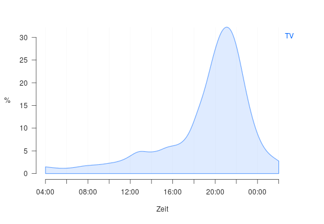

# Abstract

# Introduction 

TV audiance in Switzerland is measured by [Mediapulse AG](https:://www.mediapulse.ch/en).
A representative [panel](https:://www.mediapulse.ch/en/tv/research-method/the-panel.html)
of roughly 2000 households is constantly under [measurement](https:://www.mediapulse.ch/en/tv/research-method/the-measuring-technique.html).
These homes were carfully selected by a complex sampling design and all 
householdmembers have agreed to be part of the study. The TV viewing of each
householdmember is individually recorded and detailed demografics are known for 
each person. This allows the market to target TV audiances by relevant 
characteristics like age gender and many more.

One issue with the panel approach is poor granularity. That means sometimes 
the system can not provide any audiance figures for a specific channel or airtime.
It is likely that in the Swiss population of about 3.5 Mio. households at least
a few people are watching even exotic programs at exotic times of the day. 
However, out of a panel of 2000 households chances are high that no one was 
watching that content. This is not a bias of the measurement but poor resolution.

A solution to this problem could be the inclusion of third party data. 
Set-Top-Boxes (STB) of TV-provider (Swisscom, UPC, etc.) are automatically 
recording the TV consumption in millions of Swiss homes and the data is returned
to the providers servers (return path data, RPD). There are still many issues 
with these data that are currently adressed. 

One major issue of RPD is that the viewing data is on household level, not on 
indvidual level. Household-level data is of little use to the market. Because it
gives no insight in target groups based on age and gender and alike. 

It is unlikely that RPD provider will ever measure the individual viewing or 
survey individual demografics within the subscribers homes. Apart from region 
code, the only information about the home is the viwing data itself. So the 
question arises if it is possible to predict the household composition based 
on viewing behavior.

The aim of this study is to explore the possiblity to predict the household 
composition within a household using TV viewing data. It seems to be a 
two-step-problem, first to find the number of householdmembers and then to 
assign age and gender to the individuals.

We will use the _Mediapulse TV-Panel_ and its viewing data to study the subject.
For all households in the panel its composition including household size and 
age and sex of each person is known. For each panel home the viewing 
data will be aggregated to household level. Different supervised machine 
learning algorithms will be fed with features extracted from that houesehold 
viewing data.

# TV Viewing Data

## Raw-Data Format

TV viewing data comes in the form of daily textfiles. There are three types of 
files:

1. `dem`: all individuals with their demografics and daily weights
2. `view`: the TV viewing (live and time-shifted viewing)
3. `prog`: the program timetable with genre information

A commercial software allows Mediapulse and its clients to analyse this data 
throug a easy to use tool. I have written an R-Package that allows to read and 
analyze the very same input raw-data and output the very same results (e.g. 
daily facts like Reach, Rating or Share). Because the results between Software 
and r-package match, I am not only sure that the data processing in R is correct
but also understand exactly the calculations beeing used.

TV viewing data looks like this (simplified):

```{r, echo = FALSE}
(view <- data.frame(
  day   = rep('2018-01-01', 3),
  hh    = rep(2381, 3),
  ind   = c(1,1,2),
  chn   = c('SRF 1','ARTE','ARTE'),
  start = c('18:04:21', '18:45:20','18:45:20'),
  end   = c('18:13:02', '20:05:45','19:45:03')
))
```

Reading example: On day `2018-01-01`, in household `2381` individuum `1` is watching channel `SRF 1` from `18:04:21` to `18:13:02`. Later that day this person switches to channel `ARTE` and is joined by another householdmember individuum `2`. 

Demografic information is simply joined on keys `day`, `hh` and `ind`. Program schedule is 
joined via an overlap join on keys `day`, `channel` and `start`/`end`. If a viewing statement overlaps with multiple programs, the statement gets duplicated and the 
`start`/`end` intervals needs to be cropped to the viewing interval boundaries.

## Selecting eight Weeks of Viewing Behavior

For this study, a sample day was fixed, and the viewing data of all panel member
present at that day is collected 4 weeks prior and 4 weeks after that date. 
The sample day is the Sunday `2017-11-12` and comprises 2006 households and 4388 individuals repectively. 

The period of eight weeks should be long enough to reflect individual viewing 
behavior. Automn was choosen because during colder months people are watching 
more TV than in Sommer. Also this period is free of holidays or unusual TV events
(FIFA Wolrdcup, etc.). Within the eight weeks all seven weekdays are equally 
frequent. This is important as TV viewing differs significantly between weekends 
and workdays (Figure \ref{fig:fig1}).

## TV Viewing on household level

The TV raw-data described earlier shows that _Mediapulse TV data_ is recorded for
each individuum. In RPD data however this is not the case. RPD data only provide 
viewing data on household level. With RPD data it is unknown which person, 
or how many are sitting in front of the TV set. Also there is no demografic 
information accompaning RPD data. Here we study if it is possible 
to predict at least the number of householdmembers if only TV viewing on household 
level is known, like with RPD data. To this end the _Mediapulse TV data_ heve to 
be aggregated form individual level to household level. This means, if more than 
one person is watching the same content, on household level, this is reflected 
by a single viewing statement. The aggregation algorithm is somewhat more complex, 
but not further discussed here.

# Generating Features of Viewing Behavior

The TV raw-data described earlier is aggregated by specific weekdays, daytimes, 
channel types and program genres. This feature gereation is guided by industry 
knowledge and intuiton about TV viewing behavior we believe would carry 
information about the household composition:

1. Dimension time
    + weekend vs. working days
    + time of the day
2. Dimension content
    + type of channel 
    + type of program genre


# Appendix

```{r, echo = FALSE, fig.pos="H", out.width="90%", fig.align="center", fig.cap="\\label{fig:fig1}The sum of TV viewing duration [seconds] by weekdays during 2017. On weekends more TV is watched than during the rest of the week. Festival days often behave like Sundays."}
suppressWarnings(library(knitr))
include_graphics('../data/tv-week.png')
```

```{r echo = FALSE, fig.pos="H", out.width="90%", fig.align="center", fig.cap="\\label{fig:fig2} The relative amount of TV viewing across time of the day. The curve is the average of all 365 days in 2017. In the market the peak around 20:00 o'clock is called Primetime. On weekends the curve is flatter."}

```
